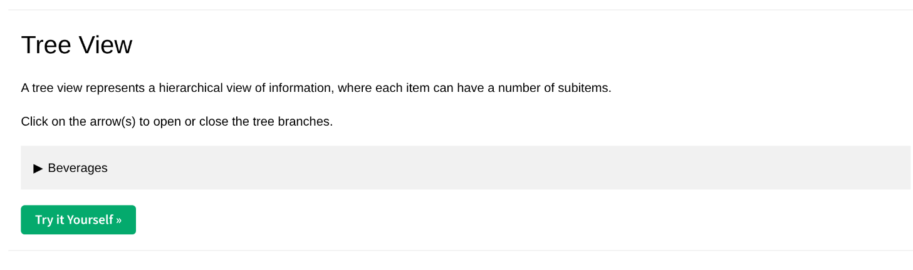
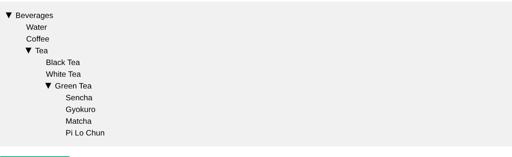

# DOM Tree Extraction & Cloud Deployment

Playwright-based web scraper for extracting hierarchical document structures from the German Handelsregister.

## Project Structure

```
playwright-web-scraper/
├── app/
│   ├── schemas/
│   │   └── response.py           # Response models
│   ├── services/
│   │   ├── playwright_utils.py   # Playwright utilities
│   │   └── tree_service.py       # Tree extraction service
│   ├── utils/
│   │   └── dom_parser.py         # DOM parsing logic
│   ├── config.py                 # Configuration
│   └── main.py                   # FastAPI application
├── assets/                       # Reference screenshots
├── .dockerignore
├── .gitignore
├── Dockerfile
├── dom_extractor.js             # DOM extraction logic
└── requirements.txt
```

## Local Development

### Setup
```bash
git clone https://github.com/zunxii/playwright-web-scraper.git
cd playwright-web-scraper

# Install dependencies
pip install -r requirements.txt
playwright install chromium
```

### Run FastAPI Server
```bash
# Development server
uvicorn app.main:app --reload --port 8000

# Production server
python -m app.main
```

### API Testing
```bash
# Test main endpoint with required URL
curl "http://localhost:8000/api/v1/div-tree?url=https://www.w3schools.com/howto/howto_js_treeview.asp"

# Swagger UI
open http://localhost:8000/docs
```

## API Endpoints

### GET /api/v1/scrape
Extracts complete DOM tree structure.

**Query Parameters:**
- `url` (required): Target page URL

**Response Schema:**
```json
{
  "label": "Documents on legal entity",
  "children": [
    {
      "label": "Articles of Association",
      "href": "document.pdf",
      "children": []
    }
  ]
}
```

**Error Response:**
```json
{
  "error": "Timeout during expansion",
  "stage": "expand"
}
```

## Docker

### Build & Test
```bash
# Build image
docker build -t europe-west3-docker.pkg.dev/koga-ai/playwright-repo/playwright-api .

# Run container
docker run -p 8000:8000 europe-west3-docker.pkg.dev/koga-ai/playwright-repo/playwright-api

# Test API
curl "http://localhost:8000/api/v1/scrap"
```

### Docker Hub
```bash
docker pull zunxii/europe-west3-docker.pkg.dev/koga-ai/playwright-repo/playwright-api
```

## GCP Deployment

### Prerequisites
```bash
# Set environment variables
export PROJECT_ID="your-unique-gcp-project-id"   # must be unique across GCP
export SERVICE_NAME="dom-tree-scraper"
export REGION="us-central1"

# (Optional) Create a new project
gcloud projects create $PROJECT_ID
gcloud config set project $PROJECT_ID

# Enable required APIs
gcloud services enable run.googleapis.com
gcloud services enable cloudbuild.googleapis.com
gcloud services enable artifactregistry.googleapis.com

# Authenticate Docker to push to gcr.io
gcloud auth configure-docker

```

### Deploy to Cloud Run
```bash
# Build & push Docker image with Cloud Build
gcloud builds submit --tag gcr.io/$PROJECT_ID/$SERVICE_NAME

# Deploy service to Cloud Run
gcloud run deploy $SERVICE_NAME \
  --image gcr.io/$PROJECT_ID/$SERVICE_NAME \
  --platform managed \
  --region $REGION \
  --allow-unauthenticated \
  --timeout=120s \
  --memory=2Gi \
  --cpu=2 \
  --set-env-vars ENV=production


### Production Testing
```bash
# Get service URL
SERVICE_URL=$(gcloud run services describe $SERVICE_NAME \
  --region $REGION --format 'value(status.url)')

# Test deployed service
curl "$SERVICE_URL/api/v1/div-tree"

# Test with verbose output
curl -v "$SERVICE_URL/api/v1/div-tree"

# Health check
curl "$SERVICE_URL/health"
```

## Live Deployment

**Public HTTPS URL**: `https://dom-tree-scraper-xyz.a.run.app`

### Example CURL Commands
```bash
# Main endpoint
curl "https://dom-tree-scraper-xyz.a.run.app/api/v1/div-tree"

# With custom URL parameter
curl "https://dom-tree-scraper-xyz.a.run.app/api/v1/div-tree?url=https://example.com"

# Health check
curl "https://dom-tree-scraper-xyz.a.run.app/health"
```

## Reference UI

### Collapsed view


### Partially expanded (example)


## Architecture

### Core Components
- **`app/main.py`**: FastAPI application entry point
- **`app/services/tree_service.py`**: Main tree extraction logic
- **`app/services/playwright_utils.py`**: Browser automation utilities
- **`app/utils/dom_parser.py`**: DOM parsing and tree building
- **`app/schemas/response.py`**: Pydantic response models
- **`dom_extractor.js`**: Client-side DOM extraction script

### Key Features
- **Robust Selectors**: CSS selectors for reliable element targeting
- **Explicit Waits**: No blind sleeps, proper element visibility checks
- **Error Handling**: Graceful failure with structured JSON responses
- **Logging**: Comprehensive stdout logging for monitoring
- **Performance**: <60s execution, <10s cold start

## Technical Notes

### DOM Expansion Strategy
1. Navigate to target page using Playwright
2. Execute search to reach document tree
3. Inject `dom_extractor.js` for client-side processing
4. Recursively expand all collapsible elements
5. Extract labels, hrefs, and hierarchy using `dom_parser.py`
6. Return structured JSON via response schemas

### Robust Selectors Used
- Tree containers: `[data-tree-container]`
- Expandable nodes: `button[aria-expanded="false"]`
- Document links: `a[href$=".pdf"]`

### Performance Characteristics
- **Timeout**: 120 seconds max
- **Memory**: 2GB allocated
- **Cold Start**: <10 seconds
- **Concurrency**: 10 concurrent requests

## Monitoring

Application logs key events:
```
[INFO] Starting extraction for URL: https://handelsregister.de/...
[INFO] Found 45 expandable nodes
[INFO] Extraction completed: 127 total nodes
[INFO] Response time: 25.3s
```

## Known Limitations
- Target site rate limiting may apply
- Some dynamic content loads asynchronously  
- Session timeouts on long extractions
- Captcha handling may require manual intervention
